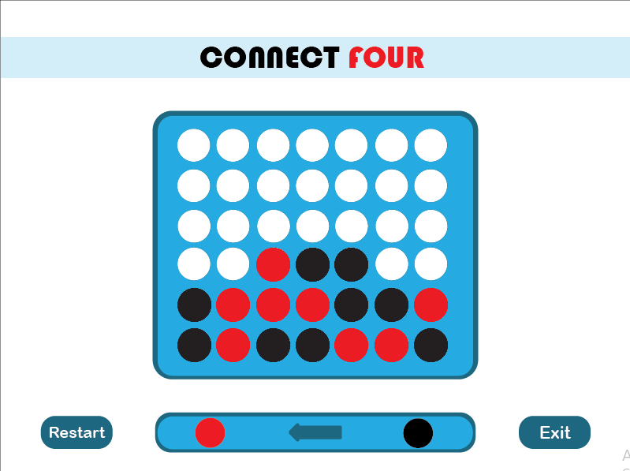
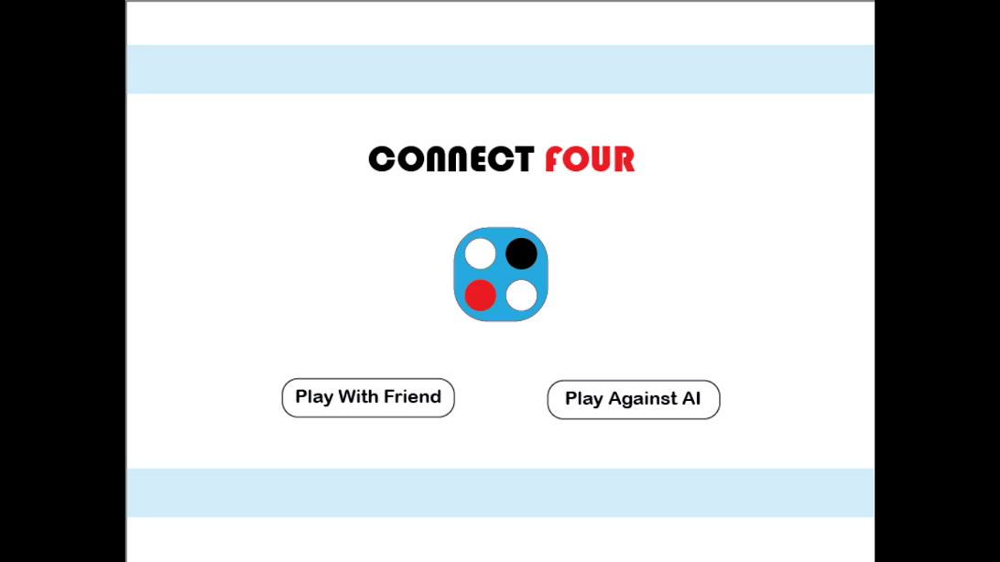
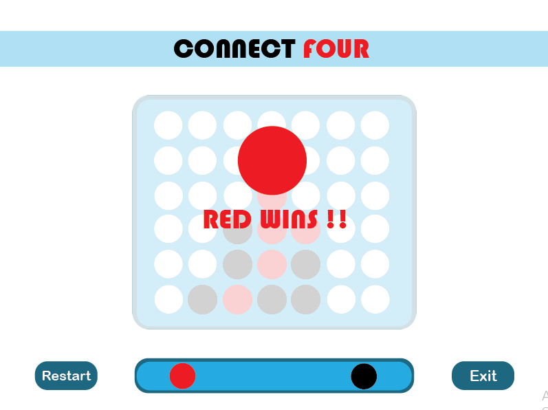
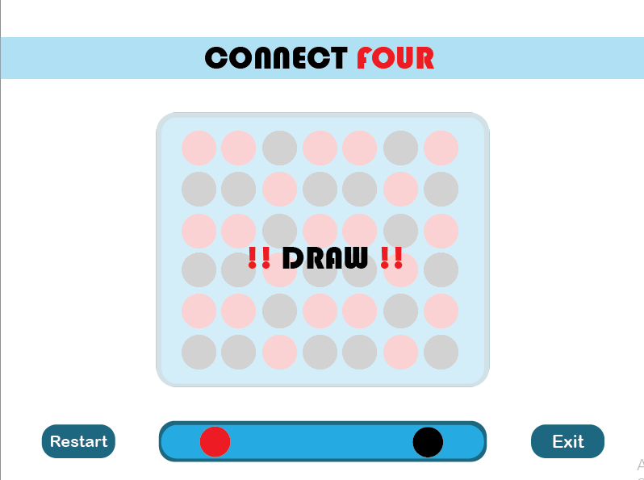

# Connect Four
Connect four game developed with with C++ and SDL2

  

## There are two modes
* Single Player : play against the computer
* 2 Players : play against a friend

## Computer intelligence
To find the best move the computer use **Alpha–beta** pruning algorithm.
Alpha–beta pruning is a decision-making algorithm. The main aim of the algorithm is to find the next best move.
The execution time of Alpha-Beta pruning algorithm is comparatively faster than **Minimax** algorithm.

  

## End of the game
The game end when a player/computer form a horizontal, vertical, or diagonal line of four of one's own discs.
If the board fills up before either player achieves four in a row, then the game is a draw.

  
  

